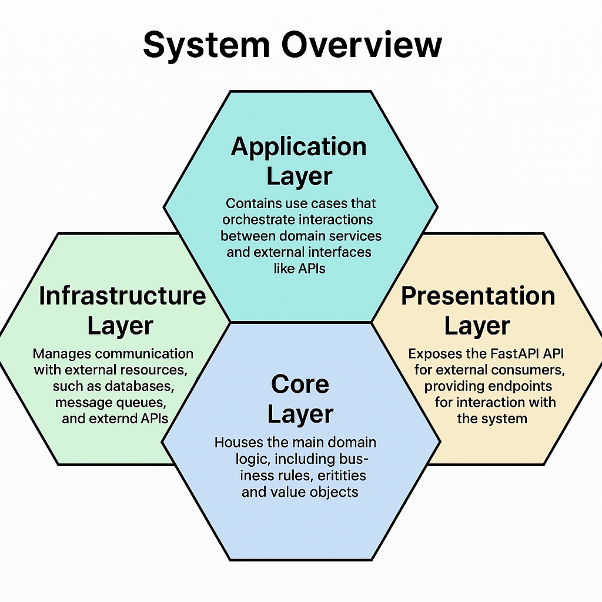
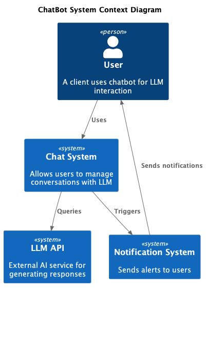
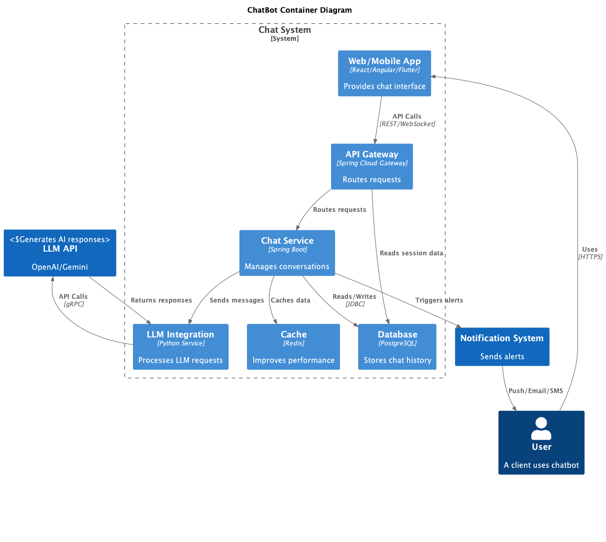

# 🤖 **Horizon Chat System**

## 🚀 **Overview**

This repository contains a **Horizon Chat System** built with **FastAPI** and adhering to **Domain-Driven Design (DDD)** principles. The system is modular, scalable, and maintainable, integrating essential features such as **authentication**, **user management**, and **bot conversations**.

The architecture is designed using **Clean Architecture** and **Modularization of a Monolithic Application**, ensuring that each feature operates within its own **bounded context**. This separation of concerns helps in managing complexity and promoting long-term maintainability.

### 🌟 **Key Features**

- **FastAPI**: High-performance web framework for building APIs, offering asynchronous support and automatic API documentation via Swagger.
- **Domain-Driven Design (DDD)**: The system follows DDD principles to maintain clear boundaries and isolate business logic in dedicated modules.
- **Command Query Separation (CQS)**: Implements CQS to separate read and write operations, enhancing maintainability and scalability.
- **Authentication & Authorization**: Secure login using JWT tokens with role-based access control (RBAC).
- **Bot Conversations**: The bot interacts with users, processes input, and manages conversation states.
- **Notifications**: Real-time notifications are sent about key events, such as message updates or system alerts, ensuring users stay informed.
- **Event-Driven Architecture**: Utilizes domain events to handle business logic changes and ensure consistency across the system.
- **Dependency Injection**: Uses dependency injection to manage dependencies and promote loose coupling between components.

## 🔍 **System Overview**

This bot system is designed with modularity in mind, following best practices to ensure the system is both scalable and maintainable. The implementation leverages **Clean Architecture** principles and **Modularization of the Monolith** to provide a clear separation of concerns between different modules.



Each feature (e.g., **auth**, **chat**, **notifications**) is encapsulated within its own bounded context, making the system easy to extend and maintain.

## 🏗️ **Architecture Overview**

### 1. System Context


*The Horizon Chat system interacts with users through web/mobile clients and integrates with external AI services and notification providers.*

### 2. Container Architecture


*Key components include:*

- **API Gateway**: Entry point for all requests
- **Conversation Service**: Manages chat sessions
- **AI Integration**: Connects to LLM providers
- **Data Stores**: PostgreSQL (primary) and Redis (caching)

## 🛠️ **Core Layer: Domain Logic**

The **Core Layer** is the heart of the system, responsible for the main business logic and domain models. In this layer, we define:

- **Entities**: Business objects that have a distinct identity (e.g., `User`, `Participants`).
- **Value Objects**: Immutable objects that represent concepts in the domain (e.g., `Content`, `Feedback`).
- **Aggregates**: Collections of entities and value objects treated as a unit (e.g., `Conversation`. `Message`).
- **Domain Services**: Provide business logic that doesn't naturally belong to an entity (e.g., `UserService`, `MessageService`).

This layered architecture ensures clear boundaries between business logic, infrastructure concerns, and application-specific code.

## 📄 **Running the Application**
For more details on setting up and running the application, please refer to the [Setup and Run guide](docs/processes/BUILDING.md).

### 🚀 Development with Docker Compose

This repository includes a `docker-compose.dev.yml` file that runs the FastAPI backend, a PostgreSQL database, pgAdmin, an NGINX reverse proxy, **and an example Next.js frontend** on a shared network.  Running the services is as simple as:

```bash
docker compose -f docker-compose.dev.yml up --build
```

After the images build and the containers start, you can access:

- 🧠 **Backend API** via NGINX at `http://localhost` (port 80).  The API documentation is available at `/docs`.
- 🎨 **Example Frontend** at `http://localhost:3000`.  This Next.js app demonstrates how to call the backend APIs, stream chat responses via Server‑Sent Events (SSE), and display conversation history.

The frontend container is configured with a `BACKEND_URL` environment variable pointing at the backend service on the Docker network, so no CORS or proxy issues occur.

### 🏗️ Production with Docker Compose

For a production‑like deployment (no hot reload), use:

```bash
docker compose -f docker-compose.prod.yml up --build
```

In this setup the backend, NGINX and the compiled frontend run in their own containers.  NGINX proxies API requests to the backend and you can access the frontend directly on port `3000` (or configure NGINX to proxy to it).  Make sure to set environment variables in your `.env` files appropriately (e.g., `DATABASE_URL`, `JWT_SECRET_KEY`).

### 👩‍💻 Manual Frontend Usage

If you prefer to run the example UI outside of Docker (for instance, during development), navigate into the `frontend` directory and start the development server:

```bash
cd frontend
npm install
npm run dev
```

Copy `.env.local.example` to `.env.local` and update `BACKEND_URL` to point at your running FastAPI backend (e.g., `http://127.0.0.1:8000`).  Then open `http://localhost:3000` in your browser to interact with the API through the UI.

### 🧑‍💻 **Authentication & Authorization**

The system uses **JWT** for secure user authentication. Upon successful login, a token is issued, which must be provided in subsequent requests to validate user actions.

#### **Endpoints**

- **POST /auth/login**: User login endpoint to authenticate and return a JWT token.

  - **Request Body:**

    ```json
    {
      "username": "string",
      "password": "string"
    }
    ```

  - **Response:**

    ```json
    {
      "access_token": "jwt_token",
      "token_type": "bearer"
    }
    ```

- **POST /auth/refresh**: Refresh JWT token.

  - **Request Body:**

    ```json
    {
      "refresh_token": "string"
    }
    ```

  - **Response:**

    ```json
    {
      "access_token": "new_jwt_token"
    }
    ```

## 💬 **Bot Conversations**

The **Conversation** entity manages the bot interactions with users, maintaining the conversation flow and ensuring state consistency.

#### **Endpoints**

- **GET /conversations/{conversation_id}**: Fetch a specific conversation by its ID.

  - **Response:**

    ```json
    {
      "conversation_id": "string",
      "messages": [
        {
          "sender": "bot",
          "content": "Hello, how can I assist you?"
        }
      ]
    }
    ```

- **POST /conversations/{conversation_id}/messages**: Send a message to the conversation.

  - **Request Body:**

    ```json
    {
      "sender": "user",
      "content": "I need help with my order"
    }
    ```

  - **Response:**

    ```json
    {
      "message_id": "string",
      "status": "sent"
    }
    ```

## 🔧 **Conclusion**

By following **Domain-Driven Design** and utilizing **FastAPI**, this bot system is highly modular and easily extendable. With clear boundaries between different concerns (such as authentication, notifications, and conversations), it’s easy for new developers to contribute and expand the system. The detailed documentation and organized file structure will guide you through the system, making it simple to understand and interact with the project.

# 📚 Domain-Driven Design (DDD) Resources

This document provides a curated list of resources for learning and implementing Domain-Driven Design (DDD).

## 1. Foundational Concepts

These resources cover the core principles and underlying concepts of DDD.

1. **Eric Evans' Book (Highly Recommended):** *Domain-Driven Design: Tackling Complexity in the Heart of Software* (This should be the first entry if you intend to recommend the book)
2. **Herberto Graca's Blog:** [Domain-Driven Design](https://herbertograca.com/2017/09/07/domain-driven-design/) - In-depth DDD principles and practical applications.
3. **Medium:** [Always-Valid Domain Model](https://vkhorikov.medium.com/always-valid-domain-model-706e5f3d24b0) - Importance of valid domain models.

## 2. Architectural Patterns & Best Practices

These resources explore architectural patterns and best practices relevant to DDD implementations.

1. **Medium:** [Onion Architecture](https://medium.com/expedia-group-tech/onion-architecture-deed8a554423) - Onion Architecture and its relation to DDD.
2. **Medium:** [Clean Domain-Driven Design](https://medium.com/unil-ci-software-engineering/clean-domain-driven-design-2236f5430a05) - Maintaining clean architecture with DDD.
3. **Code Maze:** [Clean Architecture with .NET](https://code-maze.com/dotnet-clean-architecture/) - Clean architecture principles (relevant to DDD).
4. **Vaadin Blog:** [DDD & Hexagonal Architecture in Java](https://vaadin.com/blog/ddd-part-3-domain-driven-design-and-the-hexagonal-architecture) - Combining DDD and Hexagonal Architecture.
5. **GitHub:** [Clean Architecture by Examples](https://github.com/amantinband/clean-architecture) - Clean architecture examples.

## 3. Implementation Patterns & Techniques

This section focuses on specific implementation patterns and techniques used in DDD.

1. **Medium:** [Implementing DDD Domain Models](https://medium.com/vx-company/implementing-dddomain-models-ports-adapters-and-cqrs-with-c-2b81403f09f7) - DDD domain models, Ports, Adapters, and CQRS.
2. **Medium:** [Implementing Ports & CQRS](https://abstarreveld.medium.com/dddomain-models-ports-adapters-and-cqrs-reference-architecture-c-504817df65ec) - Reference architecture for DDD models, Ports, Adapters, and CQRS.
3. **Medium:** [DDD Beyond the Basics: Mastering Aggregate Design](https://medium.com/ssense-tech/ddd-beyond-the-basics-mastering-aggregate-design-26591e218c8c) - Advanced aggregate design.
4. **Medium:** [Clean Lessons: Use Cases](https://medium.com/unil-ci-software-engineering/clean-ddd-lessons-use-cases-e9d11f64a0e9) - Use cases in clean architecture.
5. **Baeldung:** [DTO Pattern](https://www.baeldung.com/java-dto-pattern) - Data Transfer Object (DTO) pattern.
6. **Medium:** [User Authentication Basics: Hashing and JWT](https://medium.com/@nick_92077/user-authentication-basics-hashing-and-jwt-3f9adf12272) - Basics of user authentication, hashing, and JWT in DDD.
7. **Szymon Miks Blog:** [Domain Model with SQLAlchemy](https://blog.szymonmiks.pl/p/domain-model-with-sqlalchemy/) - Domain models with SQLAlchemy.

## 4. Practical Examples & Tutorials

These resources provide hands-on examples and tutorials for implementing DDD.

1. **Pluralsight:** [Domain-Driven Design in Practice](https://www.pluralsight.com/courses/domain-driven-design-in-practice) - Practical DDD implementation (course).
2. **GitHub:** [Modular Monolith with DDD](https://github.com/kgrzybek/modular-monolith-with-ddd) - Modular monolith with DDD example.
3. **GitHub:** [Python DDD Implementation](https://github.com/qu3vipon/python-ddd) - Python DDD implementation example.

## 5. Tools & Frameworks

Tools and frameworks that aid in DDD implementation.

1. **Medium:** [Python Dependency Injection](https://medium.com/@spraneeth4/python-dependency-injector-simplifying-dependency-injection-in-your-projects-14385af0bf78) - Dependency injection in Python.
2. **Hashnode:** [DDD Value Objects: Mastering Data Validation in Python](https://scresh.hashnode.dev/ddd-value-objects-mastering-data-validation-in-python) - Data validation in Python DDD value objects.
3. **GitHub:** [FastAPI Best Practices](https://github.com/zhanymkanov/fastapi-best-practices#1-project-structure-consistent--predictable) - FastAPI project structure best practices.
4. **Dev.to:** [Unit of Work & Repository with SQLModel](https://dev.to/manukanne/a-python-implementation-of-the-unit-of-work-and-repository-design-pattern-using-sqlmodel-3mb5) - Unit of Work and Repository patterns with SQLModel.
5. **Medium:** [Backend Logging in Python with FastAPI](https://medium.com/@v0220225/backend-logging-in-python-and-applied-to-fastapi-7b47118d1d92) - Backend logging in Python with FastAPI.
6. **ComputingForGeeks:** [GitHub Container Registry](https://computingforgeeks.com/configure-github-container-registry-as-your-docker-registry/) - Configuring GitHub Container Registry.
7. **Eric's Pytest Blog:** [pytest with eric](https://pytest-with-eric.com/) - pytest for Python testing (essential for robust DDD). (Moved here as it's a tool)
8. **Szymon Miks Blog:** [Domain Model with SQLAlchemy](https://blog.szymonmiks.pl/p/domain-model-with-sqlalchemy/) - Domain models with SQLAlchemy. (Moved here as it's tool/technique specific)

9. ****: [Tactical domain driven desing](https://vaadin.com/blog/ddd-part-2-tactical-domain-driven-design)

## 5. Architecture Visualization

Essential resources for designing and documenting your system architecture:

1. **Official C4 Model Site**: [https://c4model.com](https://c4model.com) - The definitive guide to C4 architecture diagrams
2. **Structurizr**: [https://structurizr.com](https://structurizr.com) - Tool for creating C4 diagrams with DSL

```bash
┌───────────────────┐       ┌──────────────────┐
│ RetrievalOrchestrator │─────>│ VectorSearchEngine │
└───────────────────┘       └──────────────────┘
       │                           ▲
       │                           │
       ▼                           │
┌───────────────────┐       ┌──────────────────┐
│   TextProcessor   │       │    IndexBuilder  │
└───────────────────┘       └──────────────────┘
       │                           ▲
       ▼                           │
┌───────────────────┐       ┌──────────────────┐
│  MemoryManager    │       │   EmbeddingModel │
└───────────────────┘       └──────────────────┘
```
