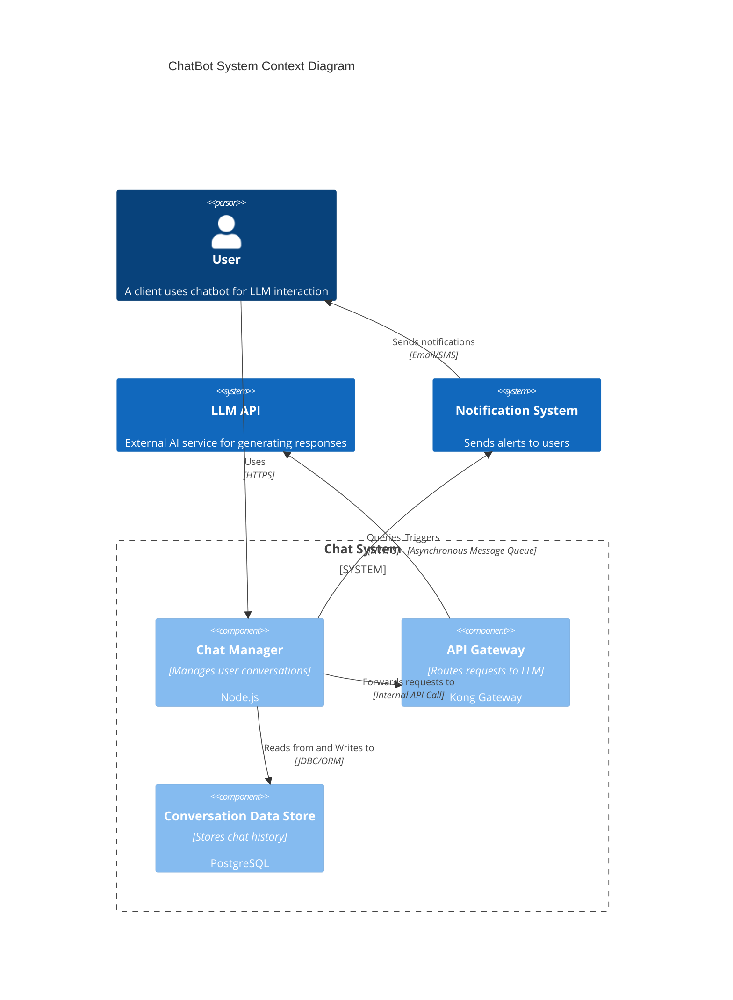

# Framework

```mermaid
C4Component
    title ChatBot System Context Diagram

    Person(user, "User", "A client uses chatbot for LLM interaction")

    System_Boundary(c1, "Chat System") {
        Component(chat_manager, "Chat Manager", "Manages user conversations", "Node.js")
        Component(api_gateway, "API Gateway", "Routes requests to LLM", "Kong Gateway")
        Component(data_store, "Conversation Data Store", "Stores chat history", "PostgreSQL")
    }

    System(llm_api, "LLM API", "External AI service for generating responses")
    System(notification_system, "Notification System", "Sends alerts to users")

    Rel(user, chat_manager, "Uses", "HTTPS")
    Rel(chat_manager, api_gateway, "Forwards requests to", "Internal API Call")
    Rel(api_gateway, llm_api, "Queries", "HTTPS")
    Rel(chat_manager, data_store, "Reads from and Writes to", "JDBC/ORM")
    Rel(chat_manager, notification_system, "Triggers", "Asynchronous Message Queue")
    Rel(notification_system, user, "Sends notifications", "Email/SMS")

```
