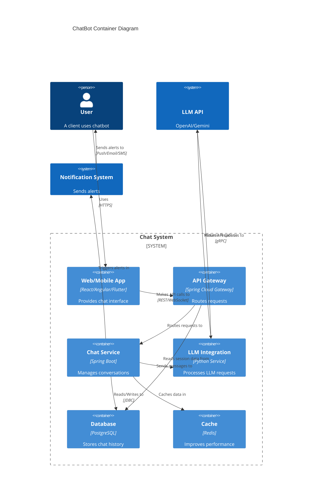

```mermaid

C4Container
    title ChatBot Container Diagram

    Person(user, "User", "A client uses chatbot")
    
    System_Boundary(chat_system, "Chat System") {
        Container(web_app, "Web/Mobile App", "React/Angular/Flutter", "Provides chat interface")
        Container(api_gateway, "API Gateway", "Spring Cloud Gateway", "Routes requests")
        Container(chat_service, "Chat Service", "Spring Boot", "Manages conversations")
        Container(llm_integration, "LLM Integration", "Python Service", "Processes LLM requests")
        Container(db, "Database", "PostgreSQL", "Stores chat history")
        Container(cache, "Cache", "Redis", "Improves performance")
    }

    System(llm, "LLM API", "OpenAI/Gemini", "Generates AI responses")
    System(notifications, "Notification System", "Sends alerts")

    Rel(user, web_app, "Uses", "HTTPS")
    Rel(notifications, user, "Sends alerts to", "Push/Email/SMS")
    Rel(web_app, api_gateway, "Makes API calls to", "REST/WebSocket")
    Rel(api_gateway, chat_service, "Routes requests to")
    Rel(chat_service, llm_integration, "Sends messages to")
    Rel(llm_integration, llm, "Makes API calls to", "gRPC")
    Rel(llm, llm_integration, "Returns responses to")
    Rel(chat_service, db, "Reads/Writes to", "JDBC")
    Rel(chat_service, cache, "Caches data in")
    Rel(api_gateway, db, "Reads session data from")
    Rel(chat_service, notifications, "Triggers alerts in")

```
