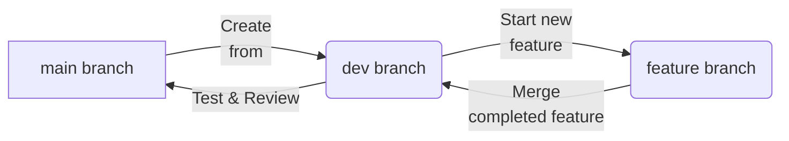

# Branching Strategy Guide

This guide outlines the branching strategy for our project to ensure consistent and collaborative development. We use two long-term branches, `main` and `dev`, alongside short-term feature branches to manage our development and release workflows.

---

## 🌳 Branch Structure Overview

### Long-Term Branches

- **`main`**: This branch contains the latest *production-ready* code. Only verified and thoroughly tested changes from `dev` are merged into `main` for deployment and release.
- **`dev`**: The primary branch for ongoing development. All feature branches should be based on `dev` and merged into `dev` once completed. `dev` serves as the staging area for testing and validation before merging into `main`.

### Short-Term Branches

- **Feature Branches**: Used to develop new features, fixes, or experiments. Feature branches should always be created from `dev` and merged back into `dev` when ready.
  
---

## 🔄 Branching Workflow

### 1. **Creating a New Feature Branch**

> **It’s highly recommended to create new feature branches from `dev` using GitLab, as it simplifies the process and maintains consistency.**

#### Option 1: **Create a Feature Branch via GitLab (Recommended)**

1. **Navigate to the GitLab Issue** that the feature or bug fix relates to.
2. Open the issue and look for the **Create a new branch** button in the issue page.
3. GitLab will automatically create a branch from `dev` for you. The new branch will be linked directly to the issue, helping track progress.
4. Name your branch in the format `feature/{{current-suggested-name-by-Gitlab}}`.
5. Click **Create Branch** to automatically create the branch and associate it with the issue (branch always checkout from `dev` branch).

#### Option 2: **Create a Feature Branch via Git**

If you prefer to use the command line, follow these steps:

1. **Make sure you’re up to date with `dev`:**

   ```bash
   git checkout dev
   git pull origin dev
    ```

2. **Create a new branch off dev for your feature:**

```bash
git checkout -b feature/your-feature-name
```

3. **Develop and commit your changes on the feature branch:**

```bash
git add .
git commit -m "Add feature X"
```

4. **Push your feature branch to the remote repository:**

```bash
Copy code
git push origin feature/your-feature-name
```

# Git Branching Workflow

## 2. Merging Feature Branches into `dev`

Once your feature is ready and tested locally, open a pull request (PR) to merge your feature branch into `dev`.

- [ ] **Review & Approvals**: Ensure at least one reviewer approves the PR.
- [ ] **Resolve Conflicts**: If there are any conflicts, resolve them as per the instructions.
- [ ] **Merge the PR**: Once approved, merge the PR into `dev`.

## 3. Verifying `dev` and Preparing for Deployment

After all feature branches are merged, `dev` will go through testing and validation. Once it’s verified and ready for production:

1. Open a pull request from `dev` to `main`.
2. Complete any additional code reviews.
3. After approval, merge `dev` into `main` for deployment.

## 📈 Branching Diagram

Below is a visual representation of our branching workflow:



In this workflow, the following guidelines should be followed:

- **✅ `main` and `dev` are long-term branches.**
  - The `main` branch represents the production-ready state.
  - The `dev` branch is the integration branch for all features.
  
- **✅ Feature branches** (e.g., `feature/your-feature-name`) are created off the `dev` branch and merged back into `dev` after completion.
  - Feature branches should always be based on the latest `dev` to ensure consistency.

- **✅ After verification, `dev` is merged into `main` for production release.**
  - Once testing and validation are complete, the `dev` branch will be merged into `main` for deployment.

## 📝 Branch Naming Conventions

To maintain a clean and consistent branch structure, follow these naming conventions:

- **Features**:  
  Use the format: `feature/your-feature-name`  
  Example: `feature/login-page`

- **Bug Fixes**:  
  Use the format: `bugfix/short-description`  
  Example: `bugfix/fix-header-alignment`

- **Hotfixes** (Urgent fixes for `main`):  
  Use the format: `hotfix/short-description`  
  Example: `hotfix/critical-db-issue`
