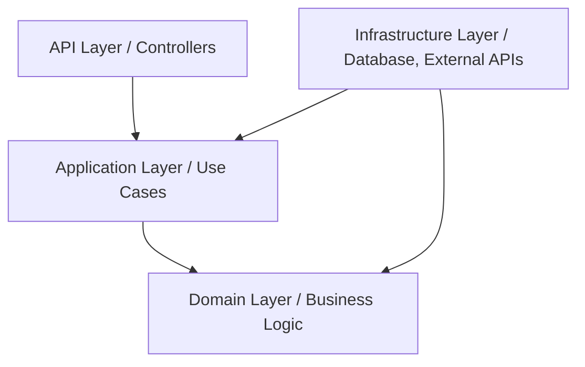
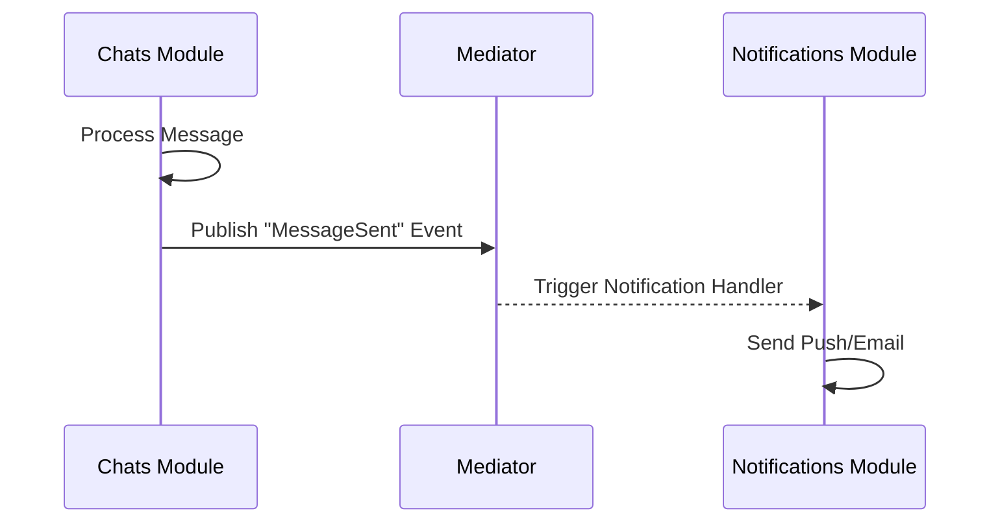
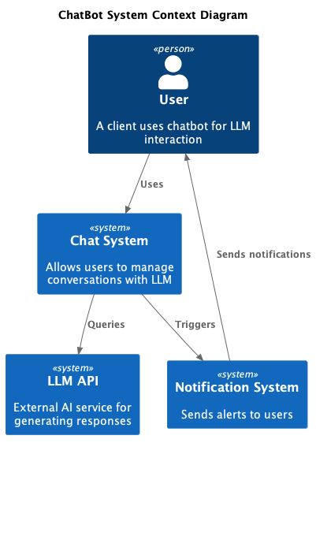

# 🏗️ Architecture Overview

Horizon Chat System is built using a **Modular Monolith** approach, guided by **Domain-Driven Design (DDD)** and **Clean Architecture** principles. This design ensures that the system is easy to understand, test, and evolve.

---

## 🧩 Architectural Patterns

### 1. Modular Monolith
The system is divided into several **Bounded Contexts** (Modules), such as `accounts`, `chats`, and `llm_backend`. Each module is semi-autonomous and encapsulates its own business logic, data models, and infrastructure.

- **Benefits**: Reduced cognitive load (work on one module at a time), easier testing, and a clear path to Microservices if ever needed.
- **Enforcement**: Modules communicate via a **Mediator** (In-process Event Bus) or well-defined interfaces, preventing tight coupling.

### 2. Clean Architecture (Layered)
Within each module, we follow a strict layered structure:



- **Domain**: The core. Contains Entities, Aggregates, and Business Rules. No dependencies on external frameworks.
- **Application**: Orchestrates use cases. Handles Commands and Queries.
- **Infrastructure**: Implementation details (SQLAlchemy, Redis, Celery).
- **API**: The entry point (FastAPI routers).

---

## 🛰️ Cross-Module Communication

Modules do not share databases or directly call each other's services unless necessary. Instead, they use an internal **Mediator** to publish and subscribe to events.



---

## 🗺️ System Maps

### System Context (C1)
Describes how the system interacts with external users and services.



### Container View (C2)
Describes the high-level technical building blocks.


---

## 🏛️ Project Structure

The codebase is organized to reflect these layers:

```text
backend/src/
├── building_blocks/      # Shared kernel (Base Entity, ValueObject, etc.)
└── modules/
    ├── accounts/         # Bounded Context: User Management & Auth
    │   ├── domain/
    │   ├── application/
    │   └── infrastructure/
    └── chats/           # Bounded Context: Conversations & Messages
        ├── domain/
        ├── application/
        └── infrastructure/
```

---

## 🧪 Documentation Summary
- **[DDD Implementation Details](../ddd/implementation.md)**: Explore the tactical patterns used in code.
- **[API References](http://localhost/docs)**: Interactive Swagger documentation.
