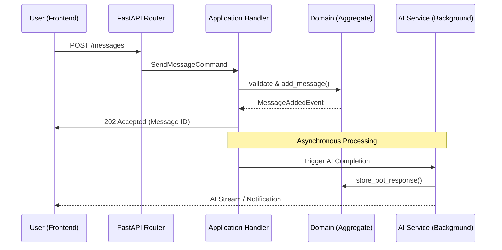

# 🤖 Bot Conversations

The `chats` module is the heart of the Horizon Chat System. It manages the lifecycle of conversations, participant involvement, and the complex flow of AI-driven messaging.

---

## 🏗️ Core Concepts

- **Conversation (Aggregate Root)**: Controls the flow, title, and participants.
- **Message (Aggregate Root)**: Represents a single unit of communication.
- **Participant**: A user or bot involved in a specific conversation.
- **AI Backend**: An external or internal service that generates bot responses.

---

## 🔄 Message Lifecycle

When a user sends a message, the system follows a well-defined path to ensure consistency and responsiveness.

### Sequence Flow



---

## 🛠️ Implementation Details

### 1. Command & Handler
Every interaction starts with a **Command** (e.g., `AddMessageCommand`). The corresponding **Handler** orchestrates the process:
1. Loads the `Conversation` aggregate from the **Repository**.
2. Executes the domain logic (e.g., `conversation.add_message(...)`).
3. Saves the changes via the **Unit of Work**.
4. Dispatches any resulting **Domain Events**.

### 2. AI Integration
The bot's response is not generated synchronously. Instead:
- The user's message is stored immediately.
- A background task is triggered (or an event is published).
- The `llm_backend` module processes the request, interacts with the AI provider, and sends the response back to the chat module.

---

## 📡 API Endpoints

### Get Conversation Details
`GET /conversations/{id}`
Returns the conversation state, including the list of message IDs.

### Send a Message
`POST /conversations/{id}/messages`
**Request Body**:
```json
{
  "content": "Tell me about the Modular Monolith architecture.",
  "metadata": {}
}
```
**Response**:
```json
{
  "message_id": "8f3a...",
  "status": "pending"
}
```

---

> [!TIP]
> To see how the AI backend is configured, check out the **[Architecture Overview](../design/architecture.md)** section on cross-module communication.
